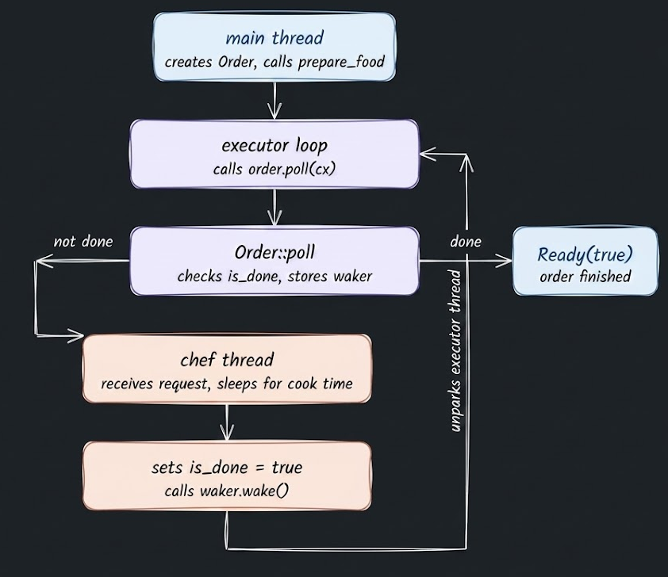

+++
title = 'Idea Behind Async Runtimes, Part 2: Understanding Future in Rust'
date = 2026-05-07T11:00:00-07:00
draft = false
tags = ['rust', 'runtimes']
+++

One of the major sources of confusion when doing async work is the difference between concurrency and parallelism. They look similar on the surface, but they're actually distinct.

**Parallelism** is when separate tasks run truly independently, at the same time, unaffected by each other, like two people each working on their own task simultaneously. This needs multiple CPU cores to actually happen.

**Concurrency**, on the other hand, is about managing multiple tasks so they can all make progress, even on a single core. This is done through context switching: the CPU rapidly hops between tasks, giving priority to bits of each, so fast that it creates the illusion they're happening at the same time, even though at any given instant only one is actually executing.

> Concurrency is about managing multiple tasks so they can make progress. On a single core machine, this is done by rapidly switching between tasks (context switching) to create the illusion that they are running at the same time.

The OS gives us concurrency through threads. But we can also achieve something more fine grained, even within a single thread, and that's where async runtimes come in.

So why bother with async runtimes if the OS already gives us concurrency via threads?

Because OS threads are expensive. Spawning and managing threads has real overhead, and the OS doesn't understand your application's internal logic, it just sees a chunk of program to execute. You can't tell it "pause exactly here, when it makes sense for my program." An async runtime, by contrast, lets you define pause points (`await`) inside your own code, so it can make smarter, cheaper scheduling decisions than the OS can from the outside.

**Tokio** is one of the most dominant async runtimes in Rust. It guarantees concurrency, and parallelism becomes a bonus on top if you have multiple cores available.

One more nuance worth keeping in mind: tasks aren't always cleanly concurrent or parallel. Sometimes one task depends on the result of another, making that part of the work serial no matter what. Concurrency and parallelism can also intersect: if you suddenly need to finish one task to unblock another, you can lose both your concurrency and your parallelism in that moment, since all effort funnels into that one blocking task.

## Setting the scene: a one chef cafe

I'll explain more technical details about `Future`, `Waker`, and `Executor` soon, but first let's build a chef for our newly opened cafe. We only have one chef (we're not rich enough for more just yet). The chef's job is to cook one order at a time and then wait for the next one. `tx` is what we use to send an order, represented as how long it takes to cook. If there's no order, the chef simply waits. Sending `0` means we're closing the cafe for the day, and the chef goes home.

```rust
struct Chef();
impl Chef {
    /// Accepts a receiver of time in milliseconds.
    /// This tells us how long a given order usually takes to prepare.
    /// The chef holds that duration, then moves on to the next order.
    fn wait_till_close(rx: Receiver<u64>) -> JoinHandle<()> {
        std::thread::spawn(move || {
            loop {
                match rx.recv() {
                    Ok(value) => {
                        if value == 0 {
                            break;
                        }
                        std::thread::sleep(std::time::Duration::from_millis(value));
                        println!("done cooking!");
                    }
                    Err(_) => {
                        break;
                    }
                }
            }
        })
    }
}

fn main() {
    let (tx, rx): (Sender<u64>, Receiver<u64>) = mpsc::channel();
    tx.send(2000).unwrap(); // an order that takes 2000ms to prepare
    tx.send(1000).unwrap();
    tx.send(0).unwrap(); // go home, chef, we're done for the day
    Chef::wait_till_close(rx).join().unwrap(); // waits until the cafe closes
}
```

Here, `mpsc` stands for multiple producer, single consumer. We use it to create a pipe that receives a duration and pauses that thread accordingly. Right now we're just printing when an order is done, but we need a real way to signal completion. So let's build out some structs.

```rust
struct OrderRequest {
    menu: Menu,
    is_done: bool,
}
```

Instead of sending a plain millisecond value through the channel, we'll send this struct, which carries both the cook time (via the menu item) and an `is_done` flag telling us whether the request has completed.

So what type should `tx` actually carry? You'd think `OrderRequest`, and that's on the right track, but `OrderRequest` needs to be accessed from two places at once: the timer thread and our main thread. Can two threads own the same piece of data directly? No. That's where `Arc` comes in: an atomic reference counter, the thread safe version of `Rc`. It's safe to clone and share across threads, and the underlying data is only dropped once the reference count hits zero.

There's one more wrinkle: we also need to mutate that shared data once the food is ready (once the timer finishes). For that we need interior mutability, and the safest tool for the job here is a `Mutex`. `RwLock` is another option, but for this example we'll stick with `Mutex`.

So technically, our `tx` and `rx` will carry: `Arc<Mutex<OrderRequest>>`.

```rust
// just pseudocode to illustrate the idea
fn main() {
    let (tx, rx) = std::sync::mpsc::channel();
    let req = OrderRequest::new(Menu::Momo);
    // tx.clone() is used wherever we need another sender

    // the request is moved into the order
    let order = Order::new(req, tx.clone());
    // Order implements Future, so it IS a future

    // now we drive the order to completion
    // this tiny executor's job is similar to what a thread does
    // you can think of it as roughly equivalent to order.await
    join(order);

    drop(tx);

    start_timer_thread(rx); // tx sends the order, rx receives it and updates is_done
}
```

So to sum up, the main thing we're doing here is creating an order and wiring up a channel that lets the timer thread and the main thread communicate.

So what's the job of that "join," the tiny executor we keep mentioning?

Its only job is to poll: to repeatedly check whether the result we want is ready yet.

The `Future` trait's `poll` method returns either `Poll::Ready(value)` or `Poll::Pending`, similar to how promises work in JavaScript. "Polling" technically just means checking whether the data is available yet. But if we did that in a tight loop, constantly asking "is it ready yet? is it ready yet?", we'd just be burning CPU cycles, which defeats the purpose of async. That's where the waker comes in.

## The Future trait

A type implementing `Future` needs to satisfy roughly this shape:

```rust
impl Future for Order {
    type Output = bool;
    // required
    fn poll(self: Pin<&mut Self>, cx: &mut Context<'_>) -> Poll<Self::Output> {
        // ...
    }
}
```

`Pin` here means the data is pinned to a fixed memory location. `cx` carries the most important piece of async in Rust: the waker. As the name suggests, the waker tells the executor when it should poll again, instead of the executor having to poll in a tight, wasteful loop. It gives the executor a clear signal for when polling is actually worthwhile.

For our problem, we need to be woken up when the timer finishes. So `OrderRequest` needs one more field: the waker.

```rust
#[derive(Clone)]
struct OrderRequest {
    menu: Menu,
    is_done: bool,
    waker: Option<Waker>,
}
```

The waker starts as `None`, because at the very beginning we don't have one yet. The executor always has to call `poll` at least once to obtain and store the waker. On that first call, the executor polls unconditionally. From then on, the waker is what tells the executor when it's actually worth polling again. That said, spurious wakeups can happen, so we can't assume `poll` is called exactly once per real state change.

Our `Order` type is what implements `Future`:

```rust
struct Order {
    request: Arc<Mutex<OrderRequest>>,
    waiter: Sender<Arc<Mutex<OrderRequest>>>,
}
```

I mentioned earlier why we need `Arc` and `Mutex`: `request` is the same data being sent over `tx`, and `Order` owns it too. When we implement `Future` for `Order`, `poll` needs to check whether the request is already done. If not, it stores the current waker on the request so that whichever thread finishes the work can call `wake()` and tell the executor "poll me again."

```rust
impl Order {
    // tx should be a sender that this Order can use to hand off its Arc-wrapped request
    fn new(request: OrderRequest, tx: Sender<Arc<Mutex<OrderRequest>>>) -> Self {
        let request = Arc::new(Mutex::new(request));
        Self {
            request,
            waiter: tx,
        }
    }
}

impl Future for Order {
    type Output = bool;

    fn poll(self: Pin<&mut Self>, cx: &mut Context<'_>) -> Poll<Self::Output> {
        let mut request = self.request.lock().unwrap();
        if !request.is_done {
            // cloning a waker is cheap, similar in spirit to cloning an Arc
            request.waker = Some(cx.waker().clone());
            let send = self.waiter.send(Arc::clone(&self.request));
            if send.is_err() {
                return Poll::Ready(false);
            }
        } else {
            return Poll::Ready(true);
        }
        Poll::Pending
    }
}
```

Walking through this: we lock the request, check whether it's done, and return `Poll::Ready(true)` if so. Otherwise we store the waker from the context (this is what the first poll looks like) and send the request off to the timer thread.

There's still a bug here, though. If the executor polls multiple times before the order is done, we end up resending the same data down the channel every time, which repeats work we don't need to repeat. Not great. The fix is a small one: add a `sent` flag so we only send the request once.

If you're curious about the waker itself, think of it as something like an `Arc`: cheap to clone, and each clone is just a reference back to the same underlying handle.

## Building the executor

We finally have a working `Future`, but we still need something to actually poll it: an executor. We'll call ours `prepare_food()`, in keeping with the cafe theme.

What should an executor actually do? Poll once, then wait for a wakeup before polling again? Pretty much, yes. To build the `Context` that `poll` needs, we implement the `Wake` trait on a small struct, say `ThreadWaker(std::thread::Thread)`:

```rust
impl Wake for ThreadWaker {
    fn wake(self: Arc<Self>) {
        self.0.unpark();
    }
}
```

`park()` blocks the current thread. `unpark()` releases it, or wakes it back up if it's already parked.

```rust
fn prepare_food(mut order: Order) -> bool {
    // Pin is needed here because poll requires a Pin<&mut Self>,
    // even though our Order isn't self-referential and doesn't strictly need it.
    let mut pinned_future = unsafe { Pin::new_unchecked(&mut order) };

    // our own waker, tied to the current (main) thread
    let thread_waker = Arc::new(ThreadWaker(std::thread::current()));
    let waker: Waker = thread_waker.into();
    let mut cx = Context::from_waker(&waker);

    loop {
        // poll the order; when the timer thread calls wake(),
        // this thread gets unparked and we poll again
        match pinned_future.as_mut().poll(&mut cx) {
            Poll::Ready(result) => return result,
            Poll::Pending => std::thread::park(), // the first poll is always Pending, so we park here
        }
    }
}

fn main() {
    let (tx, rx) = std::sync::mpsc::channel();
    let chef_handle = Chef::wait_till_close(rx);

    let request = OrderRequest::new(Menu::Momo);
    let order = Order::new(request, tx.clone());

    println!("See, I am not blocked!");

    let done = prepare_food(order);
    println!("order finished: {}", done);

    drop(tx);
    chef_handle.join().unwrap();
}
```

And that's the core mechanism, waker, executor, and poll, that Rust's async model is built on. This is still a small toy example that only scratches the surface of threads and async runtimes, but it captures the essential loop.




Here's the full, corrected code in one piece:

```rust
use std::{
    pin::Pin,
    sync::{
        Arc, Mutex,
        mpsc::{Receiver, Sender},
    },
    task::{Context, Poll, Wake, Waker},
    thread::JoinHandle,
};

struct ThreadWaker(std::thread::Thread);

impl Wake for ThreadWaker {
    fn wake(self: Arc<Self>) {
        self.0.unpark();
    }
}

// time in milliseconds
#[repr(u64)]
#[derive(Clone, Copy)]
enum Menu {
    Momo = 2000,
    Susi = 3000,
    ChickenRoulade = 4000,
}

struct Chef;
impl Chef {
    fn wait_till_close(rx: Receiver<Arc<Mutex<OrderRequest>>>) -> JoinHandle<()> {
        std::thread::spawn(move || {
            loop {
                match rx.recv() {
                    Ok(value) => {
                        let mut request = value.lock().unwrap();
                        std::thread::sleep(std::time::Duration::from_millis(request.menu as u64));
                        request.is_done = true;
                        if let Some(waker) = request.waker.take() {
                            waker.wake();
                        }
                    }
                    Err(_) => {
                        break;
                    }
                }
            }
        })
    }
}

struct Order {
    request: Arc<Mutex<OrderRequest>>,
    waiter: Sender<Arc<Mutex<OrderRequest>>>,
}

#[derive(Clone)]
struct OrderRequest {
    menu: Menu,
    is_done: bool,
    is_sent: bool,
    waker: Option<Waker>,
}

impl OrderRequest {
    fn new(menu: Menu) -> Self {
        Self {
            menu,
            is_done: false,
            is_sent: false,
            waker: None,
        }
    }
}

impl Order {
    fn new(request: OrderRequest, tx: Sender<Arc<Mutex<OrderRequest>>>) -> Self {
        let request = Arc::new(Mutex::new(request));
        Self {
            request,
            waiter: tx,
        }
    }
}

impl Future for Order {
    type Output = bool;

    fn poll(self: Pin<&mut Self>, cx: &mut Context<'_>) -> Poll<Self::Output> {
        let mut request = self.request.lock().unwrap();

        if request.is_done {
            return Poll::Ready(true);
        }

        request.waker = Some(cx.waker().clone());

        if !request.is_sent {
            request.is_sent = true;
            if self.waiter.send(Arc::clone(&self.request)).is_err() {
                return Poll::Ready(false);
            }
        }

        Poll::Pending
    }
}

fn prepare_food(mut order: Order) -> bool {
    let mut pinned_future = unsafe { Pin::new_unchecked(&mut order) };

    let thread_waker = Arc::new(ThreadWaker(std::thread::current()));
    let waker: Waker = thread_waker.into();
    let mut cx = Context::from_waker(&waker);

    loop {
        match pinned_future.as_mut().poll(&mut cx) {
            Poll::Ready(result) => return result,
            Poll::Pending => std::thread::park(),
        }
    }
}

fn main() {
    let (tx, rx) = std::sync::mpsc::channel();
    let chef_handle = Chef::wait_till_close(rx);

    let request = OrderRequest::new(Menu::Momo);
    let order = Order::new(request, tx.clone());

    println!("See, I am not blocked!");

    let done = prepare_food(order);
    println!("order finished: {}", done);

    drop(tx);
    chef_handle.join().unwrap();
}
```

## So where does `.await` actually happen?

You might notice there's no `.await` keyword anywhere in the code above. That's because `Order` is never used inside an `async fn`, we drove it by hand with `prepare_food()` instead. But `prepare_food()` is, in effect, doing exactly what `.await` does for you:

```rust
loop {
    match pinned_future.as_mut().poll(&mut cx) {
        Poll::Ready(result) => return result,
        Poll::Pending => std::thread::park(),
    }
}
```

Poll it, and if it's not ready, suspend and wait to be woken, then poll again. That loop is the whole idea behind `.await`.

### Where Tokio comes in

Tokio replaces our hand rolled `prepare_food()` executor with a real one. When you write:

```rust
#[tokio::main]
async fn main() {
    let done = my_async_fn().await;
}
```

Tokio wraps `my_async_fn()`'s compiler generated state machine as a **task**, puts it on a work queue, and a pool of worker threads pulls tasks off that queue and calls `poll` on them, exactly like our loop did, just across many tasks and many threads instead of one order and one parked thread.

A few differences from our toy version worth calling out:

- When a task's `poll` returns `Pending`, Tokio doesn't park the whole worker thread the way we did. It simply drops that task for now and moves on to poll a *different* ready task, so one thread can juggle thousands of pending futures.
- The waker in Tokio's world doesn't call `thread::unpark()` like our `ThreadWaker` did. It re-enqueues the task onto Tokio's internal ready queue, so some worker thread picks it up and polls it again the next time it's free.
- I/O futures (like `TcpStream::read().await`) register their waker with the OS's event notification system (epoll, kqueue, or IOCP depending on platform) instead of a timer thread. When the OS reports that a socket is readable, Tokio's reactor calls `wake()`, which re-queues the task.

The `poll` and `Waker` mechanics are identical either way. Tokio just does it at scale, with a real scheduler juggling many tasks instead of one thread parking on one future.

## What's next

In Part 3, we'll grow this toy executor into something closer to a real one. That means handling more than one order at a time (spawning multiple futures), building a proper task queue instead of parking a single thread, and taking a deeper look at how combinators like `join` and `select` are built on top of the same poll and waker mechanics we used here along with understanding `async` what keyword does.
