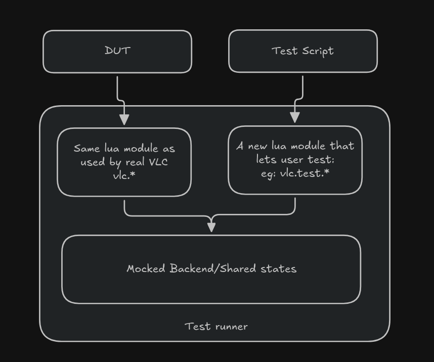
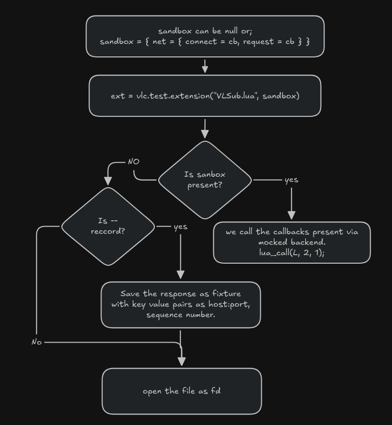

+++
title = 'My Summer at VLC - GSoC26'
date = 2026-07-10T11:00:00-07:00
draft = false
tags = ['C','Lua', 'VLC', 'Open Source']
+++

<!--
During my summer, I got the opportunity to work on one of the OG open-source software projects on the internet: VLC. My GSoC project was about building a test runner for Lua modules with a mocked backend (I'll get into what this means later). I would like to thank my mentor, Alexandre Janniaux, for helping me get into the VLC codebase, understand how tests are written, how VLC works internally, its modules and object trees, and for giving me ideas about the project itself, along with some useful tooling such as Gcov and Jujutsu.
-->


# My understanding on VLC plugin based modules
VLC core src (libvlc) is relatively small; everything else (codecs, demuxers, access, lua, etc) exists as seperate shared object (plugins). Even we can create the module, with the macro : `vlc_module_begin()`, which is a compile time macro that lets us declare a module (inside a plugin, the shared object) with its name, a capability (demux, access, etc) with priority score, and callbacks to open and close the module. A single shared object can contain multiple sub module. see for example for [lua module](https://code.videolan.org/videolan/vlc/-/blob/master/modules/lua/vlc.c?ref_type=heads#L653). VLC finds its plugins from plugins directory and opens all the dynamic libraries as needed. On runtime `module_need()` is used to load the module based on the capabilities, based on the score it goes trigger the open callbacks until it finds the desired module. On a high level this is how vlc plugin loads and works together.             

# What's actual lua modules in VLC
Lua module is one of the many modules that exists in the VLC. It registers different submodules with different capabilities.
- lua-extension (cap = `extension`) - runs ui based extensions made from lua script. (vlc ui : tools > plugins) [see examples](https://code.videolan.org/videolan/vlc/-/tree/master/share/lua/extensions?ref_type=heads)
- lua-playlist (cap = `demux`) - probes the access, and parses playlist items based on parser written on the lua script. [see examples](https://code.videolan.org/videolan/vlc/-/tree/master/share/lua/playlist?ref_type=heads)
-  lua-services-discovery (cap = `services_discovery` ) - powers Services Discovery entries in the VLC sidebar. [see examples](https://code.videolan.org/videolan/vlc/-/tree/master/share/lua/sd?ref_type=heads)
- lua-meta - Lua meta modules: art, fetcher and reader that is used to fetch album art or metadata from online sources.

In some way they are playing essentially role manging different parts of VLC using the lua script.

# The problem statement
VLC's playlist module is a demux layer with lower priority than standard demuxers (e.g., mp4). It handles input streams that are playlists (m3u) or HTTP markup, and it runs Lua scripts to parse these markups or HTTP responses into a list of playlist items which the demux pipeline can then consume  [see how playlist is used to load as demux](https://code.videolan.org/videolan/vlc/-/blob/master/test/modules/lua/playlist_parser.c?ref_type=heads#L63).

Lua extensions serve a related but distinct purpose: they let developers build Qt UI dialogs directly in Lua. For example, a dialog might include a search field that scrapes a webpage and returns a list of playlist items to the user.

In both of these scenarios: playlist-parsing scripts and extension scripts the underlying problem is that they depend on external markup that can change at any time, silently breaking the script. Because there is no automated way to verify a script's behavior, we typically only find out it's broken when a user reports it.

This is especially problematic for extensions, since verifying that a dialog's script still parses and returns the correct items currently requires building VLC, launching the Qt interface, and manually clicking through the UI. This workflow cannot be automated in CI, since it depends on live network requests and a running Qt interface.

# What do we need then?
We need a lightweight, standalone test runner that can run a Lua script as the Device Under Test (DUT), independent of a VLC build, with a mocked backend replacing the real network and Qt dependencies.So, this tool should:
 
- Since the DUT is the Lua script itself and not the plugin system, demux layer, or VLC internals. The runner needs to provide the same [Lua modules]((https://code.videolan.org/videolan/vlc/-/tree/master/modules/lua/libs?ref_type=heads)) VLC exposes, but mock out what those calls do at the C layer.
-  To assert expected behavior, each DUT script needs a corresponding test script that drives it and checks its output.
- A tester should be able to run tests in isolation against existing fixtures (e.g., recorded HTTP responses). If a fixture doesn't exist yet, or needs updating, the tester should be able to record a new one directly.

For example: For a playlist parser

```lua
-- DUT : youtube.lua

function probe()
    return vlc.access == "https" and vlc.path == "youtube.com"  
end

function parse()
    -- parses 
    return {--items}
end

```
It should have corresponding test script, that should be able to select the lua script and test it. 

```lua

function test_parsed_item()
    local parser = vlc.test.playlist_parser("youtube.lua")
    assert(parser:probe("https://youtube.com"))
    assert(#parser:parse() == 1)
end

```
Since our test runner should run the DUT it should have access to `vlc.*` so we are not mocking that, we are reusing it. On a high level the diagram looks like this:



# Test Harness for Lua Module

I have one integration test for the playlist parser merged upstream. Its purpose is to verify that the Lua module works correctly. It runs on a libvlc instance, creating a fake interface through which the stream filter module is loaded, and a test script triggers what the module is supposed to do.

For the [stream filter](https://code.videolan.org/videolan/vlc/-/blob/master/modules/lua/stream_filter.c?ref_type=heads), the main job is to trigger `probe()` for the stream, verifying its access, path, or URI. If the probe value is true, meaning our Lua script can accept the stream, we trigger `parse()`, which should return playlist items.

In testing terms:

Setup: create a fake in-memory stream carrying the sample markup, and set its mock URL..
Exercise: this happens in two steps. First, demux_New loads the luaplaylist demuxer, which internally runs probe() on the stream. Then, vlc_stream_ReadDir runs parse() on it
Verification: also happens in two steps, right after each exercise step. First we check that the demuxer was created (probe succeeded), then we check the parsed output: the number of items returned and their values
Cleanup: delete the demux, which internally unloads the module and deletes the stream as well

In this type of integration test, our DUT is the [stream filter](https://code.videolan.org/videolan/vlc/-/blob/master/modules/lua/stream_filter.c?ref_type=heads) module.

By definition, a test harness should let a user test their script with their own test data in a controlled environment. But with the approach above, a Lua script author needs to know the internal C API to properly run and verify their script, and needs to rebuild VLC every time they want to run a test. Even when something breaks, we would not know which part of the Lua script actually caused it. This is why we need a separate driver to execute the Lua script: a test runner.

A test runner's job is to execute the Lua script directly, which makes the DUT more user centric. Our test runner needs the same underlying API a real Lua script relies on. For example, `vlc.stream` should be exposed the same way it is in the case above.

```meson
# pseudocode, simplified for clarity
playlist_parser_source = files('../modules/lua/stream_filter.c')

executable('vlc-lua-mock',
    sources: ['src/main.c', playlist_parser_source],
    include_directories: [
        # includes vlc.h, libs.h from modules/lua
    ],
    c_args: common_args,
    dependencies: [lua_dep], # includes lua dependencies
    )
```

We reuse the playlist parser Lua module so that our Lua script's behavior does not diverge from the real implementation. Linking it this way results in a number of undefined references, which is expected, since the core VLC API is not linked yet for `stream_filter.c`.

For example:

```c
// pseudocode, simplified for clarity
static int vlclua_demux_read( lua_State *L )
{
    stream_t *s = (stream_t *)vlclua_get_this(L); // VLC API, undefined reference
    int n = luaL_checkinteger( L, 1 );
    char *buf = malloc(n);

    if (buf != NULL)
    {
        ssize_t val = vlc_stream_Read(s->s, buf, n); // VLC API, undefined reference
        if (val > 0)
            lua_pushlstring(L, buf, val);
        else
            lua_pushnil( L );
        free(buf);
    }
    else
        lua_pushnil( L );

    return 1;
}
```

The compiler tells us exactly which VLC APIs are touched by the Lua module. We can then define our own versions of functions like `vlc_stream_Read`, backed by our own private struct, close to the actual behavior. Some VLC APIs are unrelated to the VLC object instance, so we can plug those in directly and reuse them as is. That is essentially the gist of the mocked backend.

In testing terms:

- Setup: set up the script (DUT), the fixtures we need, and the test script that will test it
- Exercise: use our test runner to run the script through the same Lua module logic, bypassing the VLC layer, saving and checking state from the mocked environment instead
- Verification: a separate test script verifies the states the script produced, and whether it did what it was supposed to do
- Cleanup: the Lua module cleans up

[For more on the theory behind this, here is what I learned about mocking and stubbing techniques.](https://martinfowler.com/articles/mocksArentStubs.html)

Interesting part here is the testing script, that allows a scipt author to assert and control the VLC environment such as dialogs, playlist,etc. they want via lua script.

# Test Runner 
Our test runner hashed required opts flags for
- (--mode/-m) mode(playlist/extension), which helps in dir scan on the DUT script (* required)
- (--test-script/-t) lua script for DUT (* required)
- (--scripts-dir/-d) the dir scan where the harness looks for  (default: /share/lua) (* required)
- (--record/-r) the recording layer needs the libvlccore and libvlc which is dynamically loaded in case of the stream.

```lua
-- /share/lua/playlist.lua

function probe()
    return vlc.path == "some_path" -- either true or false 
end

function probe()
    -- parsing  
    assert(vlc.readline()=="your_line")
    return {{
        title: "",
        --snip
        }} 
end

```

typically to test this parser, you needs to build vlc > stream > add_stream > then it finds the demux luaplaylist > then it opens the access > finally you get segfault ;)

```lua
-- test script for above DUT
-- test.lua

function test_check_parsed_title()
    local module = vlc.test.playlist_parser("playlist.lua")
    assert(module:probe()) -- checks if our scirpt actually probes
    assert(module:parse()[1].title == "")
end
```

But, with our test runner we do first record to have fixture locally ./vlc-lua-mock -m playlist -t test.lua --record, now sometime later you can make changes on the DUT and stil test it wihout reacing the acutal stream.


How does it work?

- First we register name space in Lua State with vlc.test
```C
static const struct luaL_Reg vlc_base_funcs[] = {{NULL, NULL}};

luaL_register_namespace(L, "vlc", vlc_base_funcs);
// stack: [vlc]

lua_newtable(L); // stack: [vlc, test] stack: [-2, -1]
luaL_register(L, NULL, vlc_test_funcs); // stack: [vlc, test]
lua_setfield(L, -2, "test"); // vlc.test = test, and pops test
lua_pop(L, 1); //pop vlc to balance stack

```

LUA API are confusing because of the stack and indices, but here is what i learned:
- set* consumes meaning it automatically pops the top of the index.
- get* producces means it pushes to the stack
- check* has no change on the stack
- -1 is the index top of the stack, -2 is second from the top
- usually if stack is like this [vlc, test, table] we can set the test table with module table 
by simple : lua_setfield(L, -2, "module"), this will make the top of the index table name module and 
sets witht he vlc.test and pops it. with stack now [vlc,test]

in this way we register vlc.test.playlist_parser(), where playlist parser accepts a DUT script field. (luaL_checkstring). Previously, I had the state attached with the vlc_object_t. 
``` C
typedef struct vlc_mock_object_t{
    vlc_object_t *obj
    char         *test_script
}

```
But they could be only signatures like this : stream_t itself being inherited as object, we cannot really get the our configs by typecasting.    

``` C
ssize_t vlc_stream_Read(stream_t *s, void *buf, size_t len)
char   *vlc_stream_ReadLine(stream_t *s)
void    vlc_stream_Delete(stream_t *s)
```

Now, we have the which file to open by the via `vlclua_scripts_batch_execute` in /modules/lua/vlc.c, which will execute func on all scripts in luadirname, and stop if func returns. But in our case we only need one script to be executed. so dont link the source vlc.c, but we add

``` meson
playlist_parser_source = files(
  '../../../../modules/lua/stream_filter.c',
  '../../../../modules/lua/libs/messages.c',
  '../../../../modules/lua/libs/variables.c',
  '../../../../modules/lua/libs/stream.c',
  '../../../../modules/lua/libs/strings.c',
  '../../../../modules/lua/libs/xml.c',
  '../../../../modules/lua/libs/misc.c',
)
```

as the stream_filter.c calls and exposes the lua api to the DUT.
``` C
    luaopen_msg( L );
    luaopen_strings( L );
    luaopen_stream( L );
    luaopen_variables( L );
    luaopen_xml( L );
```
In vlc stream goes through layer, but our mocked backedn we directly intercept, so acesss, cahce, stream_filter, nothing is touched in the fixture
```
access module HTTP            <-- absent, never reached
<-- cache/prefetch filter     <-- absent
<-- stream filter category    <-- absent (vlc_stream_FilterNew returns NULL)
<-- demux / lua module        <-- present 
```

But in case of recording mode, we dynamically use them to create a new url so it will run all the layer that were absent :
``` C

    void* libvlccore = dlopen(TOP_BUILDDIR "/src/libvlccore.so", RTLD_LAZY);

    g_vlclua_record.cbs.stream_read   = dlsym(libvlccore, "vlc_stream_Read");
    g_vlclua_record.cbs.stream_new    = dlsym(libvlccore "vlc_stream_NewURL");
    g_vlclua_record.cbs.stream_delete = dlsym(libvlccore, "vlc_stream_Delete");

```

so, the typically the stream in recording mode goes through the real stream url, then we read using vlc_stream_Read, save the fixture as raw data locally. It also md5 vlc hashing function to make a lookup easier.

``` C
    char output[VLC_HASH_MD5_DIGEST_HEX_SIZE]; // size of 33 bytes 
    vlc_hash_md5_t md5;
    vlc_hash_md5_Init(&md5);
    vlc_hash_md5_Update(&md5, string, strlen(string))  

    // we can have the strlen with +1 here to take the /0 as well so we avoid collision
    // if vlc_hash_md5_Update(&md5, string, strlen(string)) is performed with text 
    // "some" at first and then "nice url" then we generate some hash
    // now if we did at first "some nice" and second "url", we generate the same hash 
    // in both case. this could be problemm if first and second terms are key and 
    // value pair while generating the hash.

    vlc_hash_FinishHex(&md5, output)
```

It also has directory, key value pair to generate because util function should take not just url but some other parameters that other can control. Like in tcp the host:port is same for the multiple request sent. So we can use the request as the key and value to uniquely generate the name for our fixture.

``` C
vlc_dictionary_t request;
vlc_dictionary_init(dict, 1);
vlc_dictionary_insert(dict, key, (void *)value);

// get keys
char **keys = vlc_dictionary_all_keys(&request);
// get value
char *value = vlc_dictionary_value_for_key(&request, keys[0]);

// clean
vlc_dictionary_clear();

// more info : includes/vlc_arrays.h  
```

In this way the stream url is hased, and later when neede they are loaded into the memory using: `vlc_stream_MemoryNew` which is compiled from : `src/input/stream_memory.c`.


```lua
-- select the dut from this api 
local pp = vlc.test.playlist_parser("playlist.lua")

-- probe tirggers the probe function in the DUT 
assert(pp:probe("https://example.com")) -- this is the stream_t we consume and find the fixture 
```

After a successful probe, call `pp:parse()` to run the dut and get back an array of item tables.

```lua
local items = pp:parse()
```
Calling `parse()` before a successful `probe()` raises an error. Each item in the returned array
looks like this:

```lua
{
  path = "...",
  name = "...",
  duration = 0, 
  options = { "opt1", "opt2" },
  metadata = {
    title = "...",
    artist = "...",
    -- snip
    }
}
```

## Extension Module

Extension module with lua module gives user to build the dialogs, ui components, use vlc.net module.

``` meson 
extension_source = files(
  '../../../../modules/lua/libs/playlist.c',
  '../../../../modules/lua/vlclua_dir.c',
  '../../../../modules/lua/extension.c',
  '../../../../modules/lua/extension_thread.c',
  '../../../../modules/lua/libs/dialog.c',
  '../../../../modules/lua/libs/net.c', 
  '../../../../modules/lua/libs/io.c',
  '../../../../modules/lua/libs/errno.c',
  '../../../../modules/lua/libs/configuration.c',
  '../../../../modules/lua/libs/input.c',
)

```

We run the extension module from our harness without module probing or vlc tree, just direct call to the entry of the module
```
// setting the scirpt to scan so the vlclua_scripts_batch_execute gets the correct file to open 
g_vlclua_mock_config.dut = p_sys->psz_script;

extensions_manager_t *p_mgr = calloc(1, sizeof(*p_sys->p_mgr));
Open_Extension(VLC_OBJECT(p_sys->p_mgr)); // runst the acutal lua scirpt
```

In extension dialogs and net module are mostly used by VLSub.lua. 
For dialog module, a global instance of config with dialog is stored.
`g_vlclua_mock_config.state->dialog`. Our gloabl mock state we store for test acutally looks like this:
```C

typedef struct {
    vlclua_mock_sandbox_t  *sandbox; /* used for tcp callbacks storage from the lua state of test script */ 
    extension_dialog_t   *dialog; /* dialog state, helps to get the widgets */
    vlc_playlist_t       *playlist; /* gloabl instance of mocked playlist */
    vlc_player_t         *player;
    vlc_array_t           net_conns; /* net_ConnectTCP only returns a fd, so a single script can have multiple conns */
    vlc_dictionary_t      modules;
    unsigned              net_call; /* to make the net request we need to have this sequence */
} vlclua_mock_state_t;


We have the live dialog state, that is currently in access by the DUT scirpt, thats why we are able to look into widgets and have control form the test framework as well.

```
// for each update to dialog it gets called 

#undef vlc_ext_dialog_update
int vlc_ext_dialog_update(vlc_object_t *p_obj, extension_dialog_t *dialog)
{
    // we get update dialog everytime 
    VLC_UNUSED(p_obj);
    g_vlclua_mock_config.state->dialog =
        (dialog->b_kill || dialog->b_hide) ? NULL : dialog;
    return VLC_SUCCESS;
}

```

Since we have the live copy of the extension that is used by both lua states: test harness and the dut. We can expose api soem api for testing framework to simulate clikc, update field values, etc. we can expose api to attach with dialog.

``` C
static const struct luaL_Reg dialog_funcs[] = {
    { "get_widget",   lua_dialog_get_widget },
    { "get_form",     lua_dialog_get_form }, 
    { "get_title",    lua_dialog_get_title },
    { "widget_count", lua_dialog_widget_count },
    { NULL, NULL }
};
static int lua_dialog_get_widget(lua_State *L) {
    lua_test_dialog_t **pp = luaL_checkudata(L, idx, DIALOG_META);
    int index = luaL_checkinteger(L, 2); 
    // currently it uses number of its creation or simply the array index of the widget to get it 
    // because extension widgets has no unique idenifier.

    extension_widget_t *p_widget = *pp->p_dialog->widgets.p_elems[index - 1];
    // we ccan push this widget to the lua state
    // so lua test framework can use it  to control the widget 
}

```

since, we dont really have a way to select particular field, there is a expoed api called get_form, which select the widgest by name and the next to it on the arraay.
usualy a lable and a field go side by side. When I search a lable then the next item will be field. It's based on assumtion, the script writer may create label first and then another lable and then the fields in such case the get_from might not work.


In this way the dialogs are contorlled form the test script to the DUT.

The another interesting mock, which i really enjoyed was. The net module. So, what really happens is
```lua

 vlc.net.connect_tcp(host, port) -- connect tcp
 vlc.net.send(fd, request) -- sends some request
 vlc.net.poll(pollfds) -- hold till we get reply because send is async
 local chunk = vlc.net.recv(fd, 2048) -- receive

```
 In our It goes through the `net_ConnectTCP`, we take the host and port name along with sequence number to generate a md5 hash and then save it in `--record` mode. While the tester can also sandbox the environment of the tcp with on_connect and on_request callbacks so no fixture is required. They can control via the test script itself. Here is the flow of what happens in both the scenarios: record and playback:

 


Now, the tcp request is an async function we cannot really hold the thread inside the `net_ConnectTCP` because it needs to return the fd. So, we create a thread acting as a mock server so we interecpt the tcp request sent from the DUT. we used `vlc_clone(&ctx->thread, mock_server, ctx)` to create a thread, and `vlc_join` to wait the thread to completion. A simpel flow of the request response cycle from the dut to our mock server is here:

 


We have used the `network/io.c` network utilities from the vlc soruce itself. This way, we load the fixture file and open the fd of the file to send to the dut.

