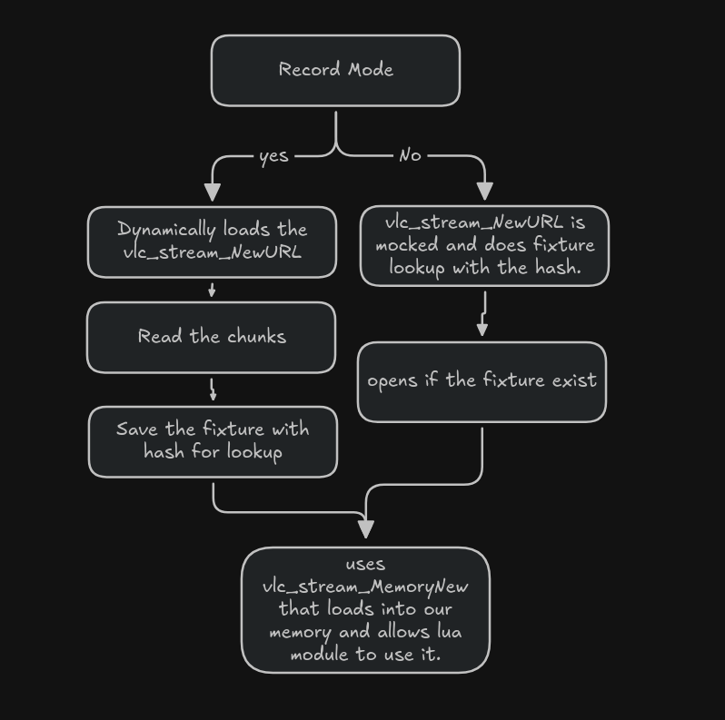
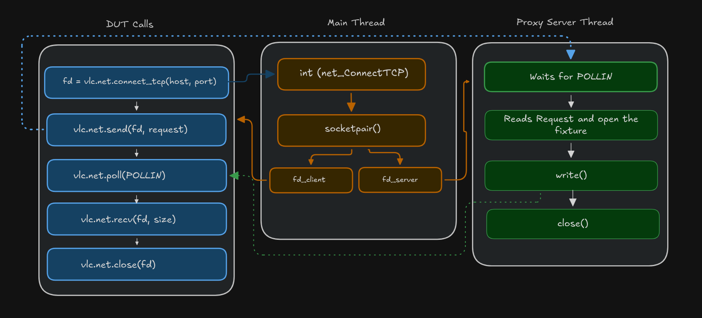

+++
title = 'My Summer at VLC - GSoC26'
description = 'Building a test harness for VLC Lua modules'
date = 2026-07-10T11:00:00-07:00
draft = false
tags = ['C','Lua', 'VLC', 'Open Source']
+++

## A test harness for VLC Lua scripts


This summer I got to work on VLC, one of the OG open source projects on the internet. My GSoC project was building a test runner for VLC's Lua modules with a mocked backend (I'll get into what that means below).

I would like to thank my mentor, Alexandre Janniaux, for helping me find my way around the VLC codebase, showing me how tests are written and how VLC internals its modules and object trees, giving me ideas for the project itself, and pointing me at tools like Gcov and Jujutsu along the way.

# My understanding on VLC plugin based modules

VLC core src (libvlc) is relatively small; everything else (codecs, demuxers, access, lua, etc) exists as separate shared objects (plugins). We can create a module ourselves with the macro `vlc_module_begin()`, which is a compile time macro that lets us declare a module (inside a plugin, the shared object) with its name, a capability (demux, access, etc) with a priority score, and callbacks to open and close the module. A single shared object can contain multiple submodules. See for example the [lua module](https://code.videolan.org/videolan/vlc/-/blob/master/modules/lua/vlc.c?ref_type=heads#L653). VLC finds its plugins from the plugins directory and opens all the dynamic libraries as needed. At runtime `module_need()` is used to load a module based on the capability, and based on the score it goes on triggering the open callbacks until it finds the desired module. On a high level this is how a vlc plugin loads and works together.

# What's actual lua modules in VLC

Lua module is one of the many modules that exists in the VLC. It registers different submodules with different capabilities.

- lua-extension (cap = `extension`) - runs ui based extensions made from lua script. (vlc ui : tools > plugins) [see examples](https://code.videolan.org/videolan/vlc/-/tree/master/share/lua/extensions?ref_type=heads)
- lua-playlist (cap = `demux`) - probes the access, and parses playlist items based on parser written on the lua script. [see examples](https://code.videolan.org/videolan/vlc/-/tree/master/share/lua/playlist?ref_type=heads)
- lua-services-discovery (cap = `services_discovery`) - powers Services Discovery entries in the VLC sidebar. [see examples](https://code.videolan.org/videolan/vlc/-/tree/master/share/lua/sd?ref_type=heads)
- lua-meta - Lua meta modules: art, fetcher and reader that is used to fetch album art or metadata from online sources.

In some way they play an essential role in managing different parts of VLC using the lua script.

# The problem statement

VLC's playlist module is a demux layer with lower priority than standard demuxers (e.g., mp4). It handles input streams that are playlists (m3u) or HTTP markup, and it runs Lua scripts to parse these markups or HTTP responses into a list of playlist items which the demux pipeline can then consume [see how playlist is used to load as demux](https://code.videolan.org/videolan/vlc/-/blob/master/test/modules/lua/playlist_parser.c?ref_type=heads#L63).

Lua extensions serve a related but distinct purpose: they let developers build Qt UI dialogs directly in Lua. For example, a dialog might include a search field that scrapes a webpage and returns a list of playlist items to the user.

In both of these scenarios: playlist-parsing scripts and extension scripts the underlying problem is that they depend on external markup that can change at any time, silently breaking the script. Because there is no automated way to verify a script's behavior, we typically only find out it's broken when a user reports it.

This is especially problematic for extensions, since verifying that a dialog's script still parses and returns the correct items currently requires building VLC, launching the Qt interface, and manually clicking through the UI. This workflow cannot be automated in CI, since it depends on live network requests and a running Qt interface.

# What do we need then?

We need a lightweight, standalone test runner that can run a Lua script as the Device Under Test (DUT), independent of a VLC build, with a mocked backend replacing the real network and Qt dependencies. So, this tool should:

- Since the DUT is the Lua script itself and not the plugin system, demux layer, or VLC internals. The runner needs to provide the same [Lua modules](https://code.videolan.org/videolan/vlc/-/tree/master/modules/lua/libs?ref_type=heads) VLC exposes, but mock out what those calls do at the C layer.
- To assert expected behavior, each DUT script needs a corresponding test script that drives it and checks its output.
- A tester should be able to run tests in isolation against existing fixtures (e.g., recorded HTTP responses). If a fixture doesn't exist yet, or needs updating, the tester should be able to record a new one directly.

For example: For a playlist parser

```lua
-- DUT : youtube.lua

function probe()
    return vlc.access == "https" and vlc.path == "youtube.com"  
end

function parse()
    -- parses 
    return {--items}
end
```

It should have corresponding test script, that should be able to select the lua script and test it.

```lua
function test_parsed_item()
    local parser = vlc.test.playlist_parser("youtube.lua")
    assert(parser:probe("https://youtube.com"))
    assert(#parser:parse() == 1)
end
```

Since our test runner should run the DUT it should have access to `vlc.*` so we are not mocking that, we are reusing it. On a high level the diagram looks like this:


# Test Harness for Lua Module

I have one integration test for the playlist parser merged upstream. It runs on a libvlc instance, creating a fake interface through which the [stream filter](https://code.videolan.org/videolan/vlc/-/blob/master/modules/lua/stream_filter.c?ref_type=heads) module is loaded, and a test script triggers what the module is supposed to do. The stream filter's main job is to trigger `probe()` for the stream, verifying its access, path, or URI. If probe returns true, meaning our Lua script can accept the stream, we trigger `parse()`, which should return playlist items.

In testing terms:

- Setup: create a fake in-memory stream carrying the sample markup, and set its mock URL
- Exercise: `demux_New` loads the luaplaylist demuxer, which internally runs `probe()`, then `vlc_stream_ReadDir` runs `parse()` on it
- Verification: check the demuxer was created (probe succeeded), then check the parsed output: the number of items returned and their values
- Cleanup: delete the demux, which internally unloads the module and deletes the stream as well

In this type of integration test, our DUT is the stream filter module.

But by definition, a test harness should let a user test their script with their own test data in a controlled environment. With the approach above, a Lua script author needs to know the internal C API to run and verify their script, and needs to rebuild VLC every time. Even when something breaks, we would not know which part of the Lua script actually caused it. This is why we need a separate driver to execute the Lua script: a test runner.

A test runner's job is to execute the Lua script directly, which makes the DUT more user centric. Our test runner needs the same underlying API a real Lua script relies on. For example, `vlc.stream` should be exposed the same way it is in the case above.

```meson
# pseudocode, simplified for clarity
playlist_parser_source = files('../modules/lua/stream_filter.c')

executable('vlc-lua-mock',
    sources: ['src/main.c', playlist_parser_source],
    include_directories: [
        # includes vlc.h, libs.h from modules/lua
    ],
    c_args: common_args,
    dependencies: [lua_dep],
    )
```

We reuse the playlist parser Lua module so that our Lua script's behavior does not diverge from the real implementation. Linking it this way results in a number of undefined references, which is expected, since the core VLC API is not linked yet for `stream_filter.c`. For example:

```c
// pseudocode, simplified for clarity
static int vlclua_demux_read( lua_State *L )
{
    stream_t *s = (stream_t *)vlclua_get_this(L); // VLC API, undefined reference
    int n = luaL_checkinteger( L, 1 );
    char *buf = malloc(n);

    if (buf != NULL)
    {
        ssize_t val = vlc_stream_Read(s->s, buf, n); // VLC API, undefined reference
        ...
    }
    return 1;
}
```

The compiler tells us exactly which VLC APIs are touched by the Lua module. We can then define our own versions of functions like `vlc_stream_Read`, backed by our own private struct, close to the actual behavior. Some VLC APIs are unrelated to the VLC object instance, so we can plug those in directly and reuse them as is. That is essentially the gist of the mocked backend. [For more on the theory behind this, here is what I learned about mocking and stubbing techniques.](https://martinfowler.com/articles/mocksArentStubs.html)

The interesting part here is the test script, which lets a script author assert and control the VLC environment such as dialogs, playlist, etc. via lua.

# Test Runner

Our test runner has these opts flags:

- (--mode/-m) mode(playlist/extension), which helps in dir scan on the DUT script (* required)
- (--test-script/-t) lua script for DUT (* required)
- (--scripts-dir/-d) the dir scan where the harness looks for (default: /share/lua)
- (--record/-r) the recording layer needs the libvlccore and libvlc which is dynamically loaded in case of the stream

```lua
-- /share/lua/playlist.lua

function probe()
    return vlc.path == "some_path" -- either true or false 
end

function parse()
    assert(vlc.readline() == "your_line")
    return {{ title = "", --snip
        }} 
end
```

typically to test this parser, you needs to build vlc > stream > add_stream > then it finds the demux luaplaylist > then it opens the access > finally you get segfault ;)

```lua
-- test script for above DUT
-- test.lua

function test_check_parsed_title()
    local module = vlc.test.playlist_parser("playlist.lua")
    assert(module:probe()) -- checks if our script actually probes
    assert(module:parse()[1].title == "")
end
```

With our test runner we first record to have the fixture locally with `./vlc-lua-mock -m playlist -t test.lua --record`, and sometime later you can make changes on the DUT and still test it without reaching the actual stream.

How does it work? First we register the namespace in the Lua State with vlc.test:

```C
static const struct luaL_Reg vlc_base_funcs[] = {{NULL, NULL}};

luaL_register_namespace(L, "vlc", vlc_base_funcs);
// stack: [vlc]

lua_newtable(L); // stack: [vlc, test]
luaL_register(L, NULL, vlc_test_funcs); // stack: [vlc, test]
lua_setfield(L, -2, "test"); // vlc.test = test, and pops test
lua_pop(L, 1); // pop vlc to balance stack
```

The Lua API is confusing because of the stack and indices, but here is what I learned:

- `set*` consumes, meaning it automatically pops the top of the index
- `get*` produces, meaning it pushes to the stack
- `check*` has no change on the stack
- -1 is the top of the stack, -2 is second from the top

In this way we register `vlc.test.playlist_parser()`, which accepts a DUT script name. Previously I had the state attached to a `vlc_object_t`, but the signatures we have to match only ever hand us a `stream_t`:

```C
ssize_t vlc_stream_Read(stream_t *s, void *buf, size_t len)
char   *vlc_stream_ReadLine(stream_t *s)
void    vlc_stream_Delete(stream_t *s)
```

There is no place to pass our own config through, and we cannot get it back by typecasting either, so the config ended up as a global instead.

Which file to open is decided via `vlclua_scripts_batch_execute` in /modules/lua/vlc.c, which executes func on all scripts in luadirname and stops if func returns. But in our case we only need one script to be executed, so we don't link vlc.c, and we add the lua libs the module needs:

```meson
playlist_parser_source = files(
  '../../../../modules/lua/stream_filter.c',
  '../../../../modules/lua/libs/messages.c',
  '../../../../modules/lua/libs/stream.c',
  '../../../../modules/lua/libs/strings.c',
  '../../../../modules/lua/libs/xml.c',
  # snip
)
```

as the stream_filter.c calls and exposes the lua api to the DUT with `luaopen_msg()`, `luaopen_strings()`, `luaopen_stream()`, `luaopen_variables()` and `luaopen_xml()`.

In vlc the stream goes through layers, but in our mocked backend we intercept at the access layer, so access, cache and the stream filters are never touched when we serve a fixture:

```
access module HTTP            <-- mocked (stream_AccessNew serves the fixture)
<-- cache/prefetch filter     <-- absent
<-- stream filter category    <-- absent (vlc_stream_FilterNew returns NULL)
<-- demux / lua module        <-- present 
```

Where exactly we cut matters here. We link `src/input/stream.c` from the VLC source itself and only replace `stream_AccessNew`, so `vlc_stream_Read`, `vlc_stream_Peek`, `vlc_stream_ReadLine` and `vlc_stream_Seek` are the real ones. 

In recording mode we load the real thing dynamically, so all the layers that were absent do run:

```C
void* libvlccore = dlopen(TOP_BUILDDIR "/src/libvlccore.so", RTLD_LAZY);

g_vlclua_record.cbs.stream_read   = dlsym(libvlccore, "vlc_stream_Read");
g_vlclua_record.cbs.stream_new    = dlsym(libvlccore, "vlc_stream_NewURL");
g_vlclua_record.cbs.stream_delete = dlsym(libvlccore, "vlc_stream_Delete");
```

So in recording mode the stream goes through the real url, we read it with `vlc_stream_Read`, and save the fixture as raw data locally. We name the file with VLC's own md5 helper so the lookup is easy. 

Since the fixture we record already went through the whole chain in real libvlc, the bytes on disk are post-filter, which is why filter attachement is stubed.

For lookup of the file, we used the md5 hash from the vlc src itself. 

```C
char output[VLC_HASH_MD5_DIGEST_HEX_SIZE]; // 33 bytes
vlc_hash_md5_t md5;
vlc_hash_md5_Init(&md5);

// the +1 takes the \0 too, so it acts as a separator between fields.
// without it, hashing "some" then "nice url" and hashing "some nice" then
// "url" give the same digest, which is a problem when the fields are a
// key and a value. the tradeoff is the digest no longer matches `md5sum`,
// so you cannot work out a fixture name from the shell.
vlc_hash_md5_Update(&md5, string, strlen(string) + 1);

vlc_hash_FinishHex(&md5, output);
```

The helper takes a `vlc_dictionary_t` of key/value pairs rather than just a url, because some callers need more than that. In tcp for example the host:port is the same across multiple requests, so we use the request itself as a field to make the name unique.

The fixture is then loaded back into memory with `vlc_stream_MemoryNew`, compiled from `src/input/stream_memory.c`.



```lua
-- select the dut from this api 
local pp = vlc.test.playlist_parser("playlist.lua")

-- probe triggers the probe function in the DUT 
assert(pp:probe("https://example.com")) -- this is the stream_t we consume and find the fixture 

-- then parse gives back the items
local items = pp:parse()
```

Calling `parse()` before a successful `probe()` raises an error. Each item in the returned array looks like `{ path, name, duration, options = {...}, metadata = { title, artist, ... } }`.

## Extension Module

The extension module lets a user build dialogs and ui components, and use the vlc.net module.

```meson
extension_source = files(
  '../../../../modules/lua/extension.c',
  '../../../../modules/lua/extension_thread.c',
  '../../../../modules/lua/libs/dialog.c',
  '../../../../modules/lua/libs/net.c', 
  '../../../../modules/lua/libs/playlist.c',
  # snip
)
```

We run the extension module from our harness without module probing or the vlc object tree, just a direct call to the entry of the module:

```C
// set the script to scan so vlclua_scripts_batch_execute opens the right file
g_vlclua_mock_config.dut = p_sys->psz_script;

p_sys->p_mgr = calloc(1, sizeof(*p_sys->p_mgr));
Open_Extension(VLC_OBJECT(p_sys->p_mgr)); // runs the actual lua script
```

In extensions, the dialog and net modules are mostly used by VLSub.lua. For the dialog module we keep the live dialog in our global mock state, which is what lets the test framework look into the widgets:

```C
typedef struct {
    vlclua_mock_sandbox_t *sandbox;  /* tcp callbacks from the test script's lua state */
    extension_dialog_t    *dialog;   /* dialog state, helps to get the widgets */
    vlc_playlist_t        *playlist;
    vlc_player_t          *player;
    vlc_array_t            net_conns; /* net_ConnectTCP only returns a fd, so one script can have many conns */
    vlc_dictionary_t       modules;
    unsigned               net_call;  /* sequence number for the net requests */
} vlclua_mock_state_t;
```

```C
// gets called on each update to the dialog

#undef vlc_ext_dialog_update
int vlc_ext_dialog_update(vlc_object_t *p_obj, extension_dialog_t *dialog)
{
    VLC_UNUSED(p_obj);
    g_vlclua_mock_config.state->dialog =
        (dialog->b_kill || dialog->b_hide) ? NULL : dialog;
    return VLC_SUCCESS;
}
```

`b_hide` and `b_kill` are orders the script gives to the UI: `dlg:hide()` sets `b_hide`, `dlg:delete()` sets `b_kill`. Both mean nothing is on screen, which is why we store NULL for either. The dialog itself is not destroyed on a hide though, so a later `dlg:show()` brings the same one back.

Since we have the live copy of the dialog used by both lua states, the test harness and the DUT, we can expose api for the test framework to simulate a click, update field values, and so on:

```C
static const struct luaL_Reg dialog_funcs[] = {
    { "get_widget",   lua_dialog_get_widget },
    { "get_form",     lua_dialog_get_form }, 
    { "get_title",    lua_dialog_get_title },
    { "widget_count", lua_dialog_widget_count },
    { NULL, NULL }
};
```

`get_widget` uses the order of creation, simply the array index, because extension widgets have no unique identifier. Since that is not a nice way to select a particular field, there is also `get_form`, which finds a widget by name and gives back the one next to it in the array. Usually a label and a field go side by side, so when I search for a label the next item is the field. It is based on that assumption, so if the script writer creates two labels first and then the fields, `get_form` will not work.

The other mock I really enjoyed was the net module. What a script does is:

```lua
vlc.net.connect_tcp(host, port) -- connect tcp
vlc.net.send(fd, request)       -- send the request first
vlc.net.poll(pollfds)           -- then wait until the reply actually arrives
local chunk = vlc.net.recv(fd, 2048)
```

In our case it goes through `net_ConnectTCP`, where we take the host and port along with a sequence number to generate an md5 hash and save it in `--record` mode. The tester can also sandbox the tcp environment with on_connect and on_request callbacks so no fixture is needed at all, and control everything from the test script:


The reason we need a thread here is that `net_ConnectTCP` hands the DUT back a real file descriptor. So, the client fd needs to be releasd than what happens to the server fd we just created using `socketpair()`?? Tha's why I introduced a seperate thread to work as a proxy thread. Everything after that, `vlc.net.send`, `vlc.net.poll` and `vlc.net.recv`, is real VLC code doing real calls on that socket. We use `vlc_clone(&ctx->thread, mock_server, ctx)` to create it, and `vlc_join` at cleanp to wait until it is done before we free what it was using. We reuse the `network/io.c` utilities from the vlc source itself. 



# What it looks like

Once a fixture exists, running the tests needs no VLC build, no network and no qt ui:

```
$ ./vlc-lua-mock -m playlist -t test.lua

Test PASSED: test_probe
Test PASSED: test_parse_first_item
Test PASSED: test_parse_elements
Test PASSED: test_parse_options_test

Test PASSED: 4, Test FAILED: 0
```

Any global function whose name starts with `test_` is found and run automatically, and a failure gives you the assertion and a traceback pointing at the line in your own test script, not somewhere inside VLC:

```
Test FAILED: test_parse_metadata_test
test.lua:33: assertion failed!
stack traceback:
	[C]: in global 'assert'
	test.lua:33: in function 'test_parse_metadata_test'

Test PASSED: 4, Test FAILED: 1
```

The extension mode works the same way, driving a real dialog built by the script:

```
$ ./vlc-lua-mock -m extension -t vlsub_test.lua

Test PASSED: test_extension_search_with_fixture
Test PASSED: test_extension_search_with_callback

Test PASSED: 2, Test FAILED: 0
```

That second run does a fair amount: it loads VLSub, opens its dialog, fills in the search field, clicks search, lets the script make its tcp request against a recorded fixture, and asserts on the result list that comes back. 

# Future works

The harness covers playlist parsers and extensions. In my proposal the scope was playlist parser, services discovery and meta reader, but my mentor suggested working on extensions instead, and that turned out to be challenging enough on its own, so that is where the time went.

- The runner already has the mode flag for sd and meta, but only playlist and extension are implemented. Services discovery and the meta reader and fetcher need the art are two remaining pieces both reusing the mocks already present in the harness.

- The harness calls VLC's functions (lua_ExtensionActivate(), lua_ExtensionDeactivate()) directly instead of putting them on the command queue. So it cannot catch bugs about timing and ordering, like a close being queued but not run yet. So maybe we need to add queue handling. VLSub uses vlc.deactivate() to queue the Deactivate command, which in real VLC goes through a separate thread, but in our case we check after every widget click whether a command got queued and whether it is a Deactivate. Works for now but needs wider support for the other commands as well, like CMD_SET_INPUT and CMD_UPDATE_META, which VLC pushes on its own when the playing media or its metadata changes. An extension that listens for those cannot be tested at all right now.

- The runner is standalone and needs no VLC build or network once the fixtures exist, which was the whole point, so wiring it into CI is mostly about deciding where the fixtures live and how they get refreshed.

- It builds as its own binary under test/modules/lua/mock right now. Making it a proper test target, so meson test runs the Lua script tests too, would put script regressions and show any breaking changes.

- My mentor suggested HTTP archives (HAR, json) for the fixtures. I save the raw response with no format for now, because tcp would need serialising on top of that and it felt like an extra step. This gives us disadvantage as we dont have manifest to know which fixture belongs to what, only our program know via hash.


# Final Words
I have always loved open source and I contribute to different projects whenever I can. But with VLC, I gave it enough time to actually understand it. My biggest learning was C itself, along with Lua and the VLC codebase. I got plenty of segfaults, and gdb was a rescue every single time. I got better at ripgrep and at reading code I did not write. jj became one of my favourite tools. I even installed [this plugin](https://github.com/sphamba/smear-cursor.nvim) because my mentor used it and I thought it was so cool that I could not stop. Every day was a new learning, and for me learning is always the main mantra. 

Overall it was a rich experience. This is not the end of the journey though, I will keep contributing to the community as much as I can. Thankyou for reading!         
